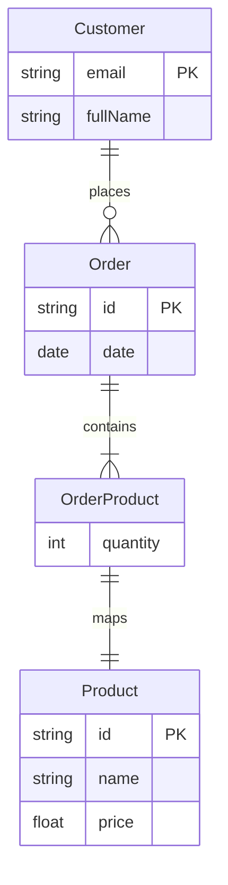

# CDK AppSync Challenge

This repository contains the codebase for deploying an AWS AppSync GraphQL API via CDK.

**_Note_**: This repository is managed via `Projen`. See <https://projen.io/docs/introduction/getting-started/> to learn more about it.

## Getting Started

### System Requirements

- [Node.js](https://nodejs.org/en/download/) (_latest LTS version_)
- [pnpm](https://pnpm.io/installation)
- [Visual Studio Code](https://code.visualstudio.com/download)
- [The AWS Command Line Interface (AWS CLI)](https://docs.aws.amazon.com/cli/latest/)
- [Granted](https://docs.commonfate.io/granted/introduction) [optional] (_useful for managing AWS CLI Profiles in your Terminal_)

### Setup

After cloning the git repo locally, run `pnpm run projen` to get started.

## Useful Commands

- `pnpm run test`: Run Tests and Linting
- `pnpm run projen`: Rebuild project configuration files
- `pnpm run build`: Build application, generate docs and run tests
- `pnpm run deploy`: Deploys the CDK Stack to your active AWS CLI Profile
- `pnpm run diff`: Compares the local CDK Stack state with a previously deployed one
- `pnpm run db:seed`: Seeds DynamoDB Table with random data for queries in the GraphQL API

## GraphQL API

[Schema](./src/api/schema.graphql)

The resolvers are configured using `VTL` templates, and can be found under the `src/api/resolver-templates` folder.
The choice of using `VTL` templates instead of `APPSYNC_JS` or Lambda for Resolvers is for keeping things lean and simple for this challenge, which doesn't require complex queries.

### Entity Relationship



### Example Query

```graphql
query {
  orders {
    id
    date
    totalAmount
    customer {
      email
      fullName
    }
    products {
      quantity
      product {
        name
        price
      }
    }
  }
}
```

_Note_: this query does not support pagination at the moment.

## DynamoDB

The DynamoDB Table acting as a Data Source for our AppSync API schema makes use of the single-table pattern.

The seed script used to add random data for queries in the GraphQL API can be found in [`src/util/seed.ts`](src/util/seed.ts), assuming the Table Schema detailed below.

### Table Schema

#### Customer Entity

| PK : String        | SK : String        | email : String | fullName : String |
| ------------------ | ------------------ | -------------- | ----------------- |
| `CUSTOMER#<email>` | `CUSTOMER#<email>` | `<email>`      | `<fullName>`      |

_Note_: The Customer `email` works as an `ID`

#### Product Entity

| PK : String    | SK : String    | id: String | name : String | price : Number |
| -------------- | -------------- | ---------- | ------------- | -------------- |
| `PRODUCT#<id>` | `PRODUCT#<id>` | `<id>`     | `<name>`      | `<price>`      |

### Order Entity

| PK : String        | SK : String  | customerEmail : String | date : String (ISO8601) | id : String | totalAmount: Number |
| ------------------ | ------------ | ---------------------- | ----------------------- | ----------- | ------------------- |
| `CUSTOMER#<email>` | `ORDER#<id>` | `<customerEmail>`      | `<dateTime>`            | `<orderId>` | `<totalAmount>`     |

_Note_: This approach allows us to query all `Orders` from a given `Customer`, but has the downside of requiring a `Scan` operation when listing all `Orders` as is given in the example query above.
